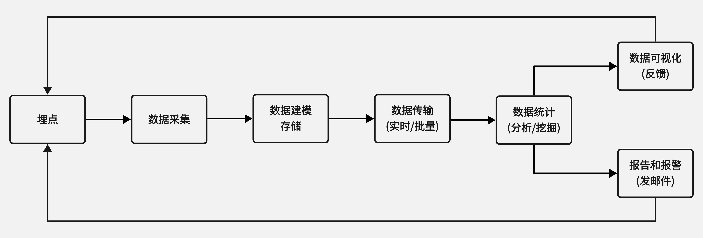

## 1. 为什么要做前端监控

-   更快发现问题和解决问题
-   做产品的决策依据
-   提升前端工程师的技术深度和广度,打造简历亮点
-   为业务扩展提供了更多可能性

## 2. 前端监控目标

### 1. 稳定性(stability)

| 错误名称 | 备注                         |
| -------- | ---------------------------- |
| JS 错误  | JS 执行错误或者 promise 异常 |
| 资源异常 | script、link 等资源加载异常  |
| 接口错误 | ajax 或 fetch 请求接口异常   |
| 白屏     | 页面空白                     |

### 2. 用户体验(experience)

| 错误名称                                    | 备注                                                                                               |
| ------------------------------------------- | -------------------------------------------------------------------------------------------------- |
| 加载时间                                    | 各个阶段的加载时间                                                                                 |
| TTFB(time to first byte)(首字节时间)        | 是指浏览器发起第一个请求到数据返回第一个字节所消耗的时间，这个时间包含了网络请求时间、后端处理时间 |
| FP(First Paint)(首次绘制)                   | 首次绘制包括了任何用户自定义的背景绘制，它是将第一个像素点绘制到屏幕的时刻                         |
| FCP(First Content Paint)(首次内容绘制)      | 首次内容绘制是浏览器将第一个 DOM 渲染到屏幕的时间,可以是任何文本、图像、SVG 等的时间               |
| FMP(First Meaningful paint)(首次有意义绘制) | 首次有意义绘制是页面可用性的量度标准                                                               |
| FID(First Input Delay)(首次输入延迟)        | 用户首次和页面交互到页面响应交互的时间                                                             |
| 卡顿                                        | 超过 50ms 的长任务                                                                                 |

### 3. 业务(business)

| 错误名称       | 备注                               |
| -------------- | ---------------------------------- |
| PV             | page view 即页面浏览量或点击量     |
| UV             | 指访问某个站点的不同 IP 地址的人数 |
| 页面的停留时间 | 用户在每一个页面的停留时间         |

## 3. 前端监控流程

-   前端埋点
-   数据上报
-   分析和计算 将采集到的数据进行加工汇总
-   可视化展示 将数据按各种维度进行展示
-   监控报警 发现问题后按一定的条件触发报警



### 1. 常见的埋点方案

#### 1. 代码埋点

-   代码埋点，就是以嵌入代码的形式进行埋点,比如需要监控用户的点击事件,会选择在用户点击时,插入一段代码，保存这个监听行为或者直接将监听行为以某一种数据格式直接传递给服务器端
-   优点是可以在任意时刻，精确的发送或保存所需要的数据信息
-   缺点是工作量较大

#### 2. 可视化埋点

-   通过可视化交互的手段，代替代码埋点
-   将业务代码和埋点代码分离，提供一个可视化交互的页面，输入为业务代码，通过这个可视化系统，可以在业务代码中自定义的增加埋点事件等等,最后输出的代码耦合了业务代码和埋点代码
-   可视化埋点其实是用系统来代替手工插入埋点代码

#### 3. 无痕埋点

-   前端的任意一个事件都被绑定一个标识，所有的事件都别记录下来
-   通过定期上传记录文件,配合文件解析，解析出来我们想要的数据，并生成可视化报告供专业人员分析
-   无痕埋点的优点是采集全量数据,不会出现漏埋和误埋等现象
-   缺点是给数据传输和服务器增加压力，也无法灵活定制数据结构

## 4. 编写监控采集脚本

### 1. 开通日志服务

[日志服务(Log Service,简称 SLS)](https://account.aliyun.com/login/login.htm?oauth_callback=https%3A%2F%2Fsls.console.aliyun.com%2Flognext%2Fprofile)是针对日志类数据一站式服务，用户无需开发就能快捷完成数据采集、消费、投递以及查询分析等功能，帮助提升运维、运营效率，建立 DT 时代海量日志处理能力
[日志服务帮助文档](https://help.aliyun.com/product/28958.html)
[Web Tracking](https://help.aliyun.com/document_detail/31752.html)

[日志查询语句](https://help.aliyun.com/document_detail/29060.html?spm=5176.2020520112.0.0.d33934c08Ya9Mh)
[日志新增 PutWebtracking 案例](https://help.aliyun.com/document_detail/120218.html)
[查询与分析日志的常见报错](https://help.aliyun.com/document_detail/61628.html?spm=5176.2020520112.0.0.d33934c08Ya9Mh)
[日志域名查询](https://help.aliyun.com/document_detail/29008.html?spm=a2c4g.11186623.0.0.6f963341feXc3W)

### 2. 监控错误(JS/资源)

#### 1. 错误分类

##### 1. JS 错误

监听 error

```js
window.addEventListener(
	'error',
	function (event) {
		if (event.target && (event.target.src || event.target.href)) {
			// console.log('资源引入错误');
		} else {
			console.log('js错误');
			// :TODO 日志上报埋点
		}
	},
	true // 捕获
);
```

##### 2. Promise 异常

监听 unhandledrejection

```js
// 当Promise 被 reject 且没有 reject 处理器的时候，会触发 unhandledrejection 事件
window.addEventListener(
	'unhandledrejection',
	function (event) {
		// :TODO 日志上报埋点
	},
	true // 捕获
);
```

##### 3. 资源异常

监听 error

```js
window.addEventListener(
	'error',
	function (event) {
		if (event.target && (event.target.src || event.target.href)) {
			console.log('资源引入错误');
			// :TODO 日志上报埋点
		}
	},
	true // 捕获
);
```

#### 2. 数据结构设计

##### 1. jsError

js 错误数据结构

```js
{
  "title": "前端监控系统",//页面标题
  "url": "http://10.165.224.179:8081/",//页面URL
  "timestamp": "1670510092167",//访问时间戳
  "userAgent": "Chrome",//用户浏览器类型
  "kind": "stability",//大类
  "type": "error",//小类
  "errorType": "jsError",//错误类型
  "message": "Uncaught TypeError: Cannot read properties of undefined (reading 'name')",//类型详情
  "filename": "http://10.165.224.179:8081/",//访问的文件名
  "position": "18:40",//行列信息
  "stack": "handleError (http://10.165.224.179:8081/:18:40)^HTMLButtonElement.onclick (http://10.165.224.179:8081/:11:51)",//堆栈信息
  "selector": "HTML BODY #root #btn1"//选择器
}
```

##### 2. promiseError

promise 错误数据结构

```js
{
  "title": "前端监控系统",//页面标题
  "url": "http://10.165.224.179:8081/",//页面URL
  "timestamp": "1670571666964",//访问时间戳
  "userAgent": "Chrome",//用户浏览器类型
  "kind": "stability",//大类
  "type": "error",//小类
  "errorType": "promiseError",//错误类型
  "message": "Cannot read properties of undefined (reading 'some')",//类型详情
  "filename": "http://10.165.224.179:8081/",//访问的文件名
  "position": "23:44",//行列信息
  "stack": "http://10.165.224.179:8081/:23:44^new Promise (<anonymous>)^handlePromiseError (http://10.165.224.179:8081/:22:13)^HTMLButtonElement.onclick (http://10.165.224.179:8081/:12:58)",//堆栈信息
  "selector": "HTML BODY #root #btn2"//选择器
}
```

##### 3. resourceError

资源 错误数据结构

```js
{
  "title": "前端监控系统",//页面标题
  "url": "http://10.165.224.179:8081/",//页面URL
  "timestamp": "1670645655094",//访问时间戳
  "userAgent": "Chrome",//用户浏览器类型
  "kind": "stability",//大类
  "type": "error",//小类
  "errorType": "resourceError",//错误类型
  "filename": "http://10.165.224.179:8081/error.js",//访问的文件名
  "tagName": "SCRIPT",//标签名
  "selector": "HTML BODY SCRIPT"//选择器
}
```

#### 3. 日志报表查询

-   [查询语句](https://help.aliyun.com/document_detail/29060.html?spm=5176.2020520112.0.0.636c34c07HzVho)

```js
// 根据kind字段进行分组查询
* | SELECT kind,count(*) as number GROUP BY kind
```

#### 4. 实现 log 项目 日志上报

##### 1. 新建 monitor-lyk 项目

```js
// 创建项目名
mark monitor-lyk
// 切换目录
cd monitor-lyk
// 生成package.json 文件管理包依赖
npm init -y
// 安装项目依赖
npm i webpack webpack-cli html-webpack-plugin webpack-dev-server user-agent -D
```

##### 2. 配置 webpack.config.js

```js
const path = require('path');
const HtmlWebpackPlugin = require('html-webpack-plugin');
const resolvePath = (p) => path.resolve(__dirname, p);

// npm i webpack webpack-cli html-webpack-plugin webpack-dev-server user-agent -D
// 导出webpack配置信息
module.exports = {
	mode: 'development', // 开发模式
	context: process.cwd(), // 工作目录
	entry: './src/index.js', // 入口文件
	output: {
		path: resolvePath('dist'), // 输出目录
		filename: 'monitor.js', // 输出文件名
	},
	// 开发服务器
	devServer: {
		// 运行代码的目录   老版写法: 		contentBase: resolvePath('dist'),
		static: {
			directory: resolvePath('dist'),
		},
		open: true,
	},
	// 配置插件
	plugins: [
		new HtmlWebpackPlugin({
			template: './src/index.html', // 模板html文件
			filename: 'index.html', // 打包之后的文件名称
			// 在head头部插入打包之后的资源
			inject: 'head',
			// HtmlWebpackPlugin版本5，  默认defer: 加了该属性的script，脚本会在文档渲染完毕后，DOMContentLoaded事件调用前执行
			scriptLoading: 'blocking', // 加载的脚本默认是defer，  设置blocking同步加载js，不然捕获不到资源错误   ******
		}),
	],
};
```

##### 3. 入口 index.html

`src/index.html`

```html
<!DOCTYPE html>
<html lang="en">
	<head>
		<meta charset="UTF-8" />
		<meta http-equiv="X-UA-Compatible" content="IE=edge" />
		<meta name="viewport" content="width=device-width, initial-scale=1.0" />
		<title>前端监控系统</title>
	</head>

	<body>
		<div id="root">
			<button id="btn1" onclick="handleError()">触发error错误</button>
			<button id="btn2" onclick="handlePromiseError()">
				触发promiseError错误
			</button>
		</div>

		<script type="text/javascript">
			// 1. js错误
			function handleError() {
				console.log(window.someObj.name);
			}
			// 2. promise 错误
			function handlePromiseError() {
				let p1 = new Promise(function (resolve, reject) {
					console.log(window.someVar.some); // 报错信息reason是object
					// reject("错误"); // 报错信息reason是string
					// reject(window.someVar.some) // 报错信息reason是object
				});
			}
		</script>

		<!-- 3. 资源加载错误 -->
		<script src="error.js"></script>
	</body>
</html>
```

##### 4. 入口 js 文件

`src\index.js`

引入错误日志上报信息

```js
import { injectJsError } from './lib/jsError';

injectJsError();
```

##### 5. 监听错误日志方法

`src\lib\jsError.js`

```js
// -   JS 错误
//     -   JS 错误		监听error
//     -   Promise 异常	监听unhandledrejection
// -   资源异常			监听error

import { getLines, getLastEvent, getSelector, tracker } from '../utils';
export function injectJsError() {
	// 1. 一般JS运行时错误使用window.onerror捕获处理
	window.addEventListener(
		'error',
		function (event) {
			// console.log('错误对象:', event);
			// 判断是否是资源加载错误
			const isResoureError =
				event.target && (event.target.src || event.target.href);

			// （1） js 报错
			if (!isResoureError) {
				// 1. 获取最后一个埋点的事件对象
				const lastEvent = getLastEvent();

				// 2. 解构错误信息对象
				const {
					lineno = 0,
					colno = 0,
					message,
					filename,
					error,
				} = event;

				// 3. 封装需要上报的日志对象信息
				const log = {
					kind: 'stability', // 大类  stability: 稳定性
					type: 'error', // 小类
					errorType: 'jsError', // JS错误类型
					message, //类型详情
					filename, //访问的文件名
					position: `${lineno}:${colno}`, //行列信息
					stack: getLines(error.stack), //堆栈信息
					selector: getSelector(lastEvent.path || lastEvent.target), // 选择器    HTML BODY #container .content INPUT
				};

				// 4. 日志上报
				tracker.send(log);
			} else {
				//（3）	资源异常
				// 1. 获取最后一个埋点的事件对象
				const lastEvent = getLastEvent();

				// 2. 解构错误信息对象
				const { target, path } = event;

				// 3. 封装需要上报的日志对象信息
				const log = {
					kind: 'stability', // 大类  stability: 稳定性
					type: 'error', // 小类
					errorType: 'resourceError', // JS错误类型
					filename: target.src || target.href, //加载失败的资源
					tagName: target.tagName, // 标签名
					selector: getSelector(path || target), // 选择器    HTML BODY #container .content INPUT
				};

				// 4. 日志上报
				tracker.send(log);
			}
		},
		true // true代表在捕获阶段调用
	);

	// （2）. 监听promise错误日志上报
	// 触发条件：
	// promise里面的语法错误 / reject()抛出的错误，状态是rejected状态，
	// 后续没有通过then的失败回调或者catch去捕获错误就会触发此监听函数
	window.addEventListener('unhandledrejection', function (event) {
		// 1. 获取最后一个埋点的事件对象
		const lastEvent = getLastEvent();

		// 2. 初始化日志需要收集的信息
		let message = ''; // 错误信息
		let lineno = 0; // 行
		let colno = 0; // 列
		let filename = ''; // 文件名
		let stack = ''; // 栈

		let reason = event.reason;

		// 2.1 获取错误message
		// 1. 如果reason是字符串，promise手动reject抛出的字符串     reject("错误")
		if (typeof reason === 'string') {
			message = reason;
		} else if (typeof reason === 'object') {
			// 2. 如果reason是object，promise里面语法错误       js语法错误/reject(`js语法错误`)
			message = reason.message;
		}

		// 2.2 将js语法错误的错误信息给提取出来
		if (typeof reason === 'object') {
			stack = reason.stack;
			if (stack) {
				// 使用正则从错误栈中匹配一些信息
				var matchResult = stack.match(/at\s+(.+):(\d+):(\d+)/);
				if (matchResult) {
					filename = matchResult[1];
					lineno = matchResult[2];
					colno = matchResult[3];
				}
				stack = getLines(`${stack}`);
			}
		}
		// 3. 封装需要上报的日志对象信息
		const log = {
			kind: 'stability', // 大类  stability: 稳定性
			type: 'error', // 小类
			errorType: 'promiseError', // promise错误类型
			message, //类型详情
			filename, //访问的文件名
			position: `${lineno}:${colno}`, //行列信息
			stack, //堆栈信息
			selector: getSelector(lastEvent.path || lastEvent.target), // 选择器    HTML BODY #container .content INPUT
		};
		// 4. 日志上报
		tracker.send(log);
	});
}
```

##### 6. 日志上报阿里日志服务埋点方法

`src\utils\tracker.js`

```js
const userAgent = require('user-agent');

// 额外数据
function getExtraData() {
	return {
		title: document.title, // 页面标题
		url: location.href, // 访问url
		timestamp: Date.now(), //访问时间戳
		userAgent: userAgent.parse(navigator.userAgent).name, // 用户浏览器类型

		// :TODO 这里可以加入一些token或者登录的用户名好去排查问题
		token: 'token111',
		userName: 'lyk111',
	};
}

// 跟踪类   向服务器发送埋点日志信息
// https://sls.console.aliyun.com/lognext/profile
// 阿里云的日志服务配置信息
// https://help.aliyun.com/document_detail/29008.html?spm=a2c4g.11186623.0.0.6f963341feXc3W     查看host域名
const host = 'cn-shanghai.log.aliyuncs.com'; // 你选择的所属区域的host域名   选择离你最近的区域
// 华东2(北京) cn-beijing.log.aliyuncs.com
// 华东2(上海) cn-shanghai.log.aliyuncs.com
const project = 'lykmonitor'; // 项目名
const logstore = 'lykmonitor-store'; // 仓库名
class Tracker {
	constructor() {
		//  https://help.aliyun.com/document_detail/120218.html  向Webtracking插入数据
		// 请求实例:
		// POST /logstores/lykmonitor-store/track HTTP/1.1         =>  lykmonitor-store => logstore
		// Host: lykmonitor.cn-shanghai.log.aliyuncs.com       => project + '.' + host
		// Content-Type:application/json        请求头类型
		this.url = `http://${project}.${host}/logstores/${logstore}/track`; // 阿里云日志服务接口地址

		// https://developer.mozilla.org/zh-CN/docs/Web/API/XMLHttpRequest
		this.xhr = new XMLHttpRequest();
	}
	send(data = {}, callback) {
		// 获取额外数据
		const extraData = getExtraData();
		// 拼接额外数据和传入的数据
		const logs = { ...extraData, ...data };

		// 阿里云日志服务，值不能是数字，需要转换成字符串
		for (let key in logs) {
			if (typeof logs[key] === 'number') {
				logs[key] = '' + logs[key];
			}
		}
		// 将数据转换成阿里云需要的json字符串格式
		let body = JSON.stringify({
			__topic__: 'lyk_app', // 日志主题
			__source__: 'app', // 日志来源
			__logs__: [logs], // 日志内容列表
		});

		// 初始化一个请求
		this.xhr.open('POST', this.url, true);

		// 设置 HTTP 请求头的值。必须在 open() 之后、send() 之前调用 setRequestHeader() 方法
		// 设置请求体类型为json格式
		this.xhr.setRequestHeader(
			'Content-Type',
			'application/json;charset=UTF-8'
		);
		// 阿里云日志服务必须要着两个请求头
		this.xhr.setRequestHeader('x-log-apiversion', '0.6.0'); // 日志版本
		this.xhr.setRequestHeader('x-log-bodyrawsize', body.length); // 请求体大小

		// 请求完成 https://developer.mozilla.org/zh-CN/docs/Web/API/XMLHttpRequest/Using_XMLHttpRequest
		this.xhr.addEventListener('load', function () {
			// console.log(111, this.status, this.readyState, this.responseText);
			if (
				(this.status >= 200 && this.status <= 300) ||
				this.status == 304
			) {
				console.log('日志上报成功!', logs);
				callback && callback();
			}
		});
		// 请求失败
		this.xhr.addEventListener('error', function (error) {
			console.log('日志上报失败!', error);
		});

		// 发送请求。如果请求是异步的（默认），那么该方法将在请求发送后立即返回。
		this.xhr.send(body);
	}
}

export default new Tracker();
```

2. `src\utils\getLastEvent.js`

获取最后一个埋点过的事件对象

```js
// 初始化最后埋点的事件对象
let lastEvent;

// 监控要埋点的事件类型
const eventTypes = [
	'click',
	'pointerdown',
	'touchstart',
	'mousedown',
	'keydown',
	'mouseover',
];

// 遍历埋点的事件类型，获取最后一个埋点的事件对象
eventTypes.forEach((event) => {
	document.addEventListener(
		event,
		(event) => {
			lastEvent = event;
		},
		{
			capture: true, // capture 控制监听器是在捕获阶段执行还是在冒泡阶段执行
			passive: true, // passive 的意思是顺从的，表示它不会对事件的默认行为说 no
		}
	);
});
// 返回最后一个埋点的对象
export default function getLastEvent() {
	return lastEvent;
}
```

3. `src\utils\getSelector.js`

将元素对象或者元素对象数组封装成字符串的格式

```js
// 转换前： 将[button事件对象, body事件对象, html事件对象, document事件对象, Window事件对象]
// 转换后： "HTML BODY Button"
const getSelectorByPath = (path) => {
	// 1. 数组反转   从 window > document > html排序
	path = path.reverse();
	// 2. 过滤掉window和document对象
	path = path.filter((ele) => ele !== window && ele !== document);
	// 3. 将元素数组对象封装成字符串
	const result = path
		.map(function (ele) {
			const { id, className, nodeName } = ele;
			// id标签       a => #a
			if (id) return `#${id}`;
			// class标签        a  b  c  => .a.b.c
			if (className && typeof className === 'string') {
				return (
					'.' +
					className
						.split(' ')
						.filter((item) => !!item) // 去除空
						.join('.')
				);
			}
			// 普通标签
			return nodeName;
		})
		.join(' ');
	return result;
};

/**
 * 将元素对象或者元素对象数组封装成字符串的格式
 * @param {Object|Array} pathsOrTarget
 * @returns {String}
 */
export default function getSelector(pathsOrTarget) {
	// 1. 是一个元素对象数组
	if (Array.isArray(pathsOrTarget)) {
		return getSelectorByPath(pathsOrTarget);
	} else {
		// 2. 单个元素对象
		const paths = [];
		let element = pathsOrTarget;
		// 遍历找它的父级元素，形成一条元素对象数组
		while (element) {
			paths.push(element);
			element = element.parentNode;
		}
		return getSelectorByPath(paths);
	}
}
```

### 3. 接口异常采集脚本

#### 1. 数据设计

`成功接口返回200`

```js
{
  "title": "前端监控系统", //标题
  "url": "http://localhost:8080/", //url
  "timestamp": "1670669964173", //timestamp
  "userAgent": "Chrome", //浏览器版本
  "kind": "stability", //大类
  "type": "xhr", //小类
  "eventType": "load", //事件类型
  "pathname": "/success", //路径
  "status": "200-OK", //状态码
  "duration": "4", //持续时间
  "response": "{\"id\":1}", //响应内容
  "params": ""  //参数
}
```

`成功接口返回500`

```js
{
  "title": "前端监控系统", //标题
  "url": "http://localhost:8080/", //url
  "timestamp": "1670669975588", //timestamp
  "userAgent": "Chrome", //浏览器版本
  "kind": "stability", //大类
  "type": "xhr", //小类
  "eventType": "load", //事件类型
  "pathname": "/error", //路径
  "status": "500-Internal Server Error", //状态码
  "duration": "4", //持续时间
  "response": "", //响应内容
  "params": "name=lyk"  //参数
}
```

`失败接口`

```js
{
  "title": "前端监控系统",
  "url": "http://localhost:8080/",
  "timestamp": "1670669989117",
  "userAgent": "Chrome",
  "kind": "stability",
  "type": "xhr",
  "eventType": "error",
  "pathname": "https://somewhere.org/i-dont-exist",
  "status": "0-",
  "duration": "835",
  "response": "",
  "params": ""
}
```

`请求中断`

```js
{
  "title": "前端监控系统",
  "url": "http://localhost:8080/",
  "timestamp": "1670669994145",
  "userAgent": "Chrome",
  "kind": "stability",
  "type": "xhr",
  "eventType": "abort",
  "pathname": "/success",
  "status": "0-",
  "duration": "1",
  "response": "",
  "params": ""
}
```

#### 2. 代码实现

##### 1. 配置 webpack.config.js

-   配置 devServer 的 setupMiddlewares 中间件，模拟后端 get/post 接口，来做接口请求拦截案例

```js
const path = require('path');
const HtmlWebpackPlugin = require('html-webpack-plugin');
const resolvePath = (p) => path.resolve(__dirname, p);

// npm i webpack webpack-cli html-webpack-plugin webpack-dev-server user-agent -D
// 导出webpack配置信息
module.exports = {
	mode: 'development', // 开发模式
	context: process.cwd(), // 工作目录
	entry: './src/index.js', // 入口文件
	output: {
		path: resolvePath('dist'), // 输出目录
		filename: 'monitor.js', // 输出文件名
	},
	// 开发服务器
	devServer: {
		// 运行代码的目录   老版写法: 		contentBase: resolvePath('dist'),
		static: {
			directory: resolvePath('dist'),
		},
		open: true, // 自动打开浏览器
		// // 注册before钩子
		// webpack5 写法
		setupMiddlewares: (middlewares, devServer) => {
			if (!devServer)
				throw new Error('webpack-dev-server is not defined');
			// express 写法
			// 注册/success路由			访问	/success
			devServer.app.get('/success', function (req, res) {
				res.json({ id: 1 }); // 响应成功
			});
			// 注册/error路由			访问	/error
			devServer.app.post('/error', function (req, res) {
				res.sendStatus(500); // 响应失败
			});
			return middlewares;
		},
	},
	// 配置插件
	plugins: [
		new HtmlWebpackPlugin({
			template: './src/index.html', // 模板html文件
			filename: 'index.html', // 打包之后的文件名称
			// 在head头部插入打包之后的资源
			inject: 'head',
			// HtmlWebpackPlugin版本5，  添加了 scriptLoading 属性配置
			// https://www.npmjs.com/package/html-webpack-plugin	scriptLoading
			// {'blocking'|'defer'|'module'} 支持3个配置，默认defer,异步加载（脚本会在文档渲染完毕后，DOMContentLoaded事件调用前执行）
			scriptLoading: 'blocking', // 设置blocking同步加载js，不然捕获不到资源错误   ******
		}),
	],
};
```

##### 2. 入口 index.html

`src\index.html`

```html
<!DOCTYPE html>
<html lang="en">
	<head>
		<meta charset="UTF-8" />
		<meta http-equiv="X-UA-Compatible" content="IE=edge" />
		<meta name="viewport" content="width=device-width, initial-scale=1.0" />
		<title>前端监控系统</title>
	</head>

	<body>
		<div id="root">
			<!-- 1. 监控js错误 -->
			<p>1. 监控js错误</p>
			<button id="btn1" onclick="handleError()">触发error错误</button>
			<button id="btn2" onclick="handlePromiseError()">
				触发promiseError错误
			</button>
			<br />

			<!-- 2. 监控接口错误 -->
			<p>2. 监控接口错误</p>
			<button id="btn3" onclick="sendAjaxSuccess()">
				发起ajax成功请求
			</button>
			<button id="btn3-1" onclick="sendAjax500Success()">
				ajax发送请求响应500
			</button>
			<button id="btn4" onclick="sendAjaxError()">
				发起ajax失败请求
			</button>
			<button id="btn5" onclick="sendAjaxAbort()">
				发起ajax请求中断
			</button>
		</div>

		<!-- 1. 监控js错误 -->
		<script type="text/javascript">
			// 1.1 js错误
			function handleError() {
				console.log(window.someObj.name);
			}
			// 1.2 promise 错误
			function handlePromiseError() {
				let p1 = new Promise(function (resolve, reject) {
					console.log(window.someVar.some); // 报错信息reason是object
					// reject("错误"); // 报错信息reason是string
					// reject(window.someVar.some) // 报错信息reason是object
				});
			}
		</script>
		<!-- 1.3 资源加载错误 -->
		<!-- <script src="error.js" /> -->

		<!-- 2. 监控接口错误 -->
		<script>
			// ajax发送请求成功
			function sendAjaxSuccess() {
				let xhr = new XMLHttpRequest(); // 初始化XMLHttpRequest实例
				xhr.open('GET', '/success', true); // 初始化一个请求
				xhr.responseType = 'json'; // 响应体返回类型
				// xhr.onload = (event) => console.log(xhr.response);  //  请求成功回掉
				xhr.send(); // 发送请求
			}
			// ajax发送请求响应500
			function sendAjax500Success() {
				let xhr = new XMLHttpRequest(); // 初始化XMLHttpRequest实例
				xhr.open('POST', 'error', true); // 初始化一个请求
				xhr.responseType = 'json'; // 响应体返回类型
				// xhr.onload = (event) => console.log(event);  //  请求成功回掉
				xhr.send('name=lyk'); // 发送请求
			}
			// ajax发送请求失败
			function sendAjaxError() {
				let xhr = new XMLHttpRequest(); // 初始化XMLHttpRequest实例
				xhr.open('GET', 'https://somewhere.org/i-dont-exist', true); // 初始化一个请求
				xhr.responseType = 'json'; // 响应体返回类型
				// xhr.onerror = event => console.log(event) // 请求失败回掉
				xhr.send(); // 发送请求
			}
			// ajax发送请求后再终止
			function sendAjaxAbort() {
				let xhr = new XMLHttpRequest(); // 初始化XMLHttpRequest实例
				xhr.open('GET', '/success', true); // 初始化一个请求
				xhr.send(); // 发送请求
				xhr.abort(); // 中断请求
			}
		</script>
	</body>
</html>
```

##### 3. 入口 js 文件

`src\monitor\index.js`

```js
import { injectJsError } from './lib/jsError';
import { injectXHRError } from './lib/xhrError';

injectJsError();
injectXHRError();
```

##### 4. 监听接口错误的方法，并日志上报阿里日志服务埋点方法

主要实现方式：就是`拦截接口请求的原生方法`，类似 vue2.x 的数组方法的拦截

`src\lib\xhrError.js`

```js
import { tracker } from '../utils';

/**
 * 拦截接口XHR请求          （fetch没有拦截）  *****  TODO:   后续可以实现一个拦截fetch请求的
 * 实现： 接口异常采集脚本
 * https://developer.mozilla.org/zh-CN/docs/Web/API/XMLHttpRequest
 */
export function injectXHRError() {
	let XMLHttpRequest = window.XMLHttpRequest;
	// 1. 拿到旧的初始化请求的open方法
	let oldOpen = XMLHttpRequest.prototype.open;

	// 2. 拦截open方法，定义哪些接口需要拦截
	XMLHttpRequest.prototype.open = function (method, url, async) {
		// 2.1 定义一个标识，对哪些接口实现接口拦截
		// 过滤掉logstores的云服务器接口和sockjs的webpack请求       ***** TODO: 这里面可以由用户配置，拦截哪些接口
		if (!url.match(/logstores/) && !url.match(/sockjs/)) {
			this.logData = { method, url, async };
		}
		// 2.2 初始化请求
		return oldOpen.apply(this, arguments);
	};
	// 3. 拿到旧的发送请求的send方法
	let oldSend = XMLHttpRequest.prototype.send;

	// 4. 拦截send方法，实现接口监控采集上报
	XMLHttpRequest.prototype.send = function (body) {
		// 4.1 需要接口上报集采的接口
		if (this.logData) {
			let start = Date.now();
			let handler = (event) => {
				let duration = Date.now() - start; // 计算接口耗时
				let status = this.status; // 获取状态code     200/304/500 ...
				let statusText = this.statusText; // 获取状态tetext OK/Internal Server Error ...
				// 4.2 接口埋点上报
				tracker.send({
					kind: 'stability', //稳定性指标
					type: 'xhr', // 接口类型
					eventType: event.type, // 接口请求的状态 load error abort
					pathname: this.logData.url, // 接口的url地址
					status: status + '-' + statusText, // 状态code + 状态text
					duration, //接口耗时
					response: this.response
						? JSON.stringify(this.response)
						: '', // 响应体
					params: body || '', // 请求体
				});
			};
			// 监听接口请求的状态   https://developer.mozilla.org/zh-CN/docs/Web/API/XMLHttpRequest/error_event
			// loadstart, load, loadend, progress, error,  abort

			// load  只要服务器请求通了，就执行， 200，300，404，500 都会触发
			this.addEventListener('load', handler);
			// error 只有当服务器请求不通，才执行
			this.addEventListener('error', handler);
			// abort 只有当接口请求中断才会执行
			this.addEventListener('abort', handler);
		}
		// 4.3 真正发送请求的地方
		oldSend.apply(this, arguments);
	};
}
```

### 4. 页面白屏采集脚本

-   白屏就是页面上什么都没有

#### 1. 数据设计

```js
{
  "title": "前端监控系统",
  "url": "http://localhost:8080/",
  "timestamp": "1670837989410",
  "userAgent": "chrome",
  "kind": "stability",      //大类
  "type": "blank",          //小类
  "emptyPoints": "14",       //空白点
  "screen": "1920x1080",    //分辨率
  "viewPoint": "910x937",  //视口
  "selector": "HTML BODY #container" //选择器
}
```

#### 2. 代码实现

[screen](https://developer.mozilla.org/zh-CN/docs/Web/API/Window/screen) 返回当前 window 的 screen 对象,返回当前渲染窗口中和屏幕有关的属性
[innerWidth](https://developer.mozilla.org/zh-CN/docs/Web/API/Window/innerWidth) 只读的 Window 属性 innerWidth 返回以像素为单位的窗口的内部宽度
[innerHeight](https://developer.mozilla.org/zh-CN/docs/Web/API/Window/innerHeight) 窗口的内部高度(布局视口)的高度
[layout_viewport](https://developer.mozilla.org/en-US/docs/Glossary/layout_viewport)
[elementsFromPoint](https://developer.mozilla.org/zh-CN/docs/Web/API/Document/elementsFromPoint) 方法可以获取到当前视口内指定坐标处，由里到外排列的所有元素

实现思路

1. 记录以哪些元素当作参考依据来代表现在是白屏的 TODO: 这个也可以用户去定义标准
    - 例如：刚开始页面就有 html,body,#root
2. 页面加载完成时，从页面中取 n 个点，判断这些点是否还在上面依据为空白的元素上面 TODO: n 个点也可以用户去定义标准
    - 选取点的方式可以自己设置，
        - 例如：x , y 轴 各取 10 个点 一个十字
        - 例如：x ，y 轴 各取 10 个点，然后从左右角落下去再分别取 10 个点 +,x
3. 初始化一个变量，来计算空白点的数量
4. 空白点的数量大于一个临界值 (m) 就代表当前页面是白屏页面 TODO: 这个临界值也可以用户传入进来
    - 这个临界值可以自己设置
5. 白屏日志上报

##### 1. 入口 index.html

`src\index.html`

```html
<!DOCTYPE html>
<html lang="en">
	<head>
		<meta charset="UTF-8" />
		<meta http-equiv="X-UA-Compatible" content="IE=edge" />
		<meta name="viewport" content="width=device-width, initial-scale=1.0" />
		<title>前端监控系统</title>

		<style>
			* {
				margin: 0;
				padding: 0;
			}

			#root {
				width: 100vw;
				height: 100vh;
				word-break: break-all;
			}
		</style>
	</head>

	<body>
		<div id="root"></div>

		<script>
			// 模拟设置当前页面不是白屏
			const root = document.getElementById('root');

			// 1. 将整个屏幕铺满一部分
			const div = document.createElement('div');
			div.innerHTML = '@'.repeat(300);
			root.appendChild(div);

			// 2. 将整个屏幕铺满
			// const div = document.createElement('div');
			// div.innerHTML = '@'.repeat(3000);
			// root.appendChild(div);
		</script>
	</body>
</html>
```

##### 2. 入口 js 文件

`src\index.js`

```js
// 1. js promise 资源加载错误监控
import { injectJsError } from './lib/jsError';
// 2. 接口监控
import { injectXHRError } from './lib/xhrError';
// 3. 白屏监控
import { blankScreen } from './lib/blankScreen';

injectJsError();
injectXHRError();
blankScreen();
```

##### 3. 监听页面白屏的方法，并且埋点上报阿里日志服务

`src\lib\blankScreen.js`

```js
/**
 * 监控白屏上报日志
 * 实现思路:
 * 1. 记录以哪些元素当作参考依据来代表现在是白屏的           TODO: 这个也可以用户去定义标准
 *      - 例如：刚开始页面就有html,body,#root
 * 2. 页面加载完成时，从页面中取 n 个点，判断这些点是否还在上面依据为空白的元素上面      TODO: n个点也可以用户去定义标准
 *      - 选取点的方式可以自己设置，
 *          - 例如：x , y轴 各取10个点      一个十字
 *          - 例如：x ，y轴 各取10个点，然后从左右角落下去再分别取10个点    +,x
 * 3. 初始化一个变量，来计算空白点的数量
 * 4. 空白点的数量大于一个临界值 (m) 就代表当前页面是白屏页面           TODO: 这个临界值也可以用户传入进来
 *      - 这个临界值可以自己设置
 * 5. 白屏日志上报
 */
import { onload, tracker, getSelector } from '../utils';

export function blankScreen() {
	// 1. 初始化依据为空白元素
	const blankWrapperSelectors = ['html', 'body', '#root'];

	// 3. 记录空白点
	let emptyPoints = 0;
	// 元素是否是空白元素包裹
	function isBlankWrapper(element) {
		// 获取当前点的元素: HTML BODY #root   ,  HTML BODY #root #btn3-1
		let selector = getSelector(element);

		// 通过空格分割，获取最后一个元素 HTML BODY #root  => #root
		const eleList = selector.split(' ');
		const insideEle = eleList.pop() || '';

		// 当前选中点的元素就是空白元素，空白点++
		if (blankWrapperSelectors.indexOf(insideEle.toLocaleLowerCase()) >= 0)
			emptyPoints++;
	}

	// 2. 页面加载完成时，从页面中取 n 个点，判断这些点是否还在上面依据为空白的元素上面
	onload(function () {
		// 初始化 x ， y 轴坐标点的元素
		let xElements, yElements;
		for (let i = 1; i <= 9; i++) {
			// x 点元素
			xElements = document.elementsFromPoint(
				(window.innerWidth * i) / 10,
				window.innerHeight / 2
			);
			// y 点元素
			yElements = document.elementsFromPoint(
				window.innerWidth / 2,
				(window.innerHeight * i) / 10
			);
			// 记录空白元素
			isBlankWrapper(xElements[0]);
			isBlankWrapper(yElements[0]);
		}
		// 4. 空白点大于 0 代表在页面中选取的坐标点元素有空白的地方，就代表现在还是白屏的
		console.log('空白点：', emptyPoints);
		if (emptyPoints >= 0) {
			let centerElements = document.elementsFromPoint(
				window.innerWidth / 2,
				window.innerHeight / 2
			);
			// 5. 白屏日志上报
			tracker.send({
				kind: 'stability', // 大类
				type: 'blank', // 小类
				emptyPoints, // 空白点
				screen: window.screen.width + 'x' + window.screen.height, // 分辨率
				viewPoint: window.innerWidth + 'x' + window.innerHeight, // 视口
				selector: getSelector(centerElements[0]), // 选择器
			});
		}
	});
}
```
